# 🌍 Qartezator: Yet another aerial image-to-map translator

Qartezator is your translator between aerial images and maps.


# Environment setup

Clone the repo: `git clone https://github.com/AndranikSargsyan/qartezator.git`

Set up virtualenv:
```bash
cd qartezator
python3 -m venv venv
source venv/bin/activate
pip install -r requirements.txt 
```

If you need torch+cuda, you can use the following command
```bash
pip install torch==1.13.1+cu116 torchvision==0.14.1+cu116 --extra-index-url https://download.pytorch.org/whl/cu116
```

# Demo
Download all models from [this link](https://drive.google.com/drive/folders/1dFtVLJXO7fuq9lYFIXMMquFS5cO1t4i4?usp=sharing) and place inside `models/` directory.

### StreamLit

Start StreamLit demo by running:
```bash
streamlit run demo.py
```

### CLI Inference
```bash
python -m qartezator.inference -m PATH-TO-MODEL -i PATH-TO-IMAGE -o OUTPUT-PATH
```

# Training   
```bash
python -m qartezator.train --config-path ./qartezator/configs/qartezator-fourier.yaml
```

# Results

### Qartezator-Fourier
<table class="center">
    <tr>
      <th width=25% align="center">Aerial image</th>
      <th width=25% align="center">Target map</th>
      <th width=25% align="center">Predicted map</th>
    </tr>
    <tr>
      <td>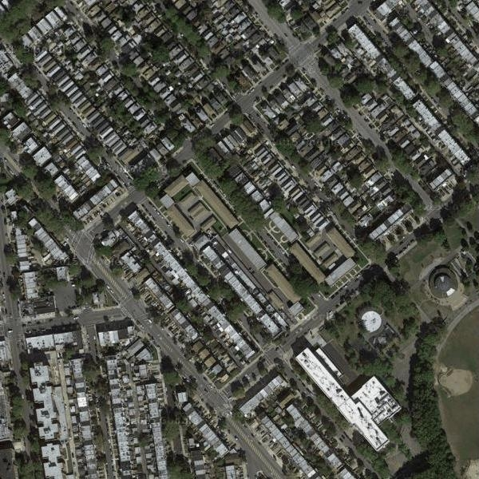</td>
      <td>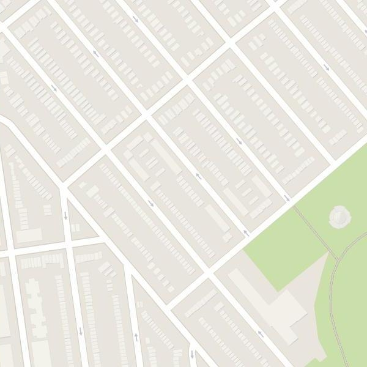</td>
      <td>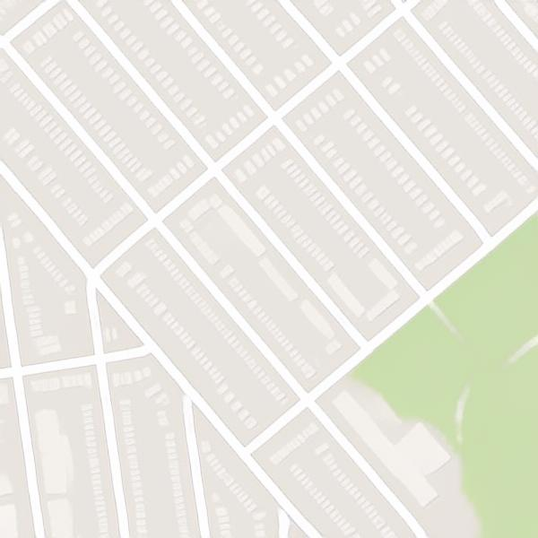</td>              
    </tr>
    <tr>
      <td>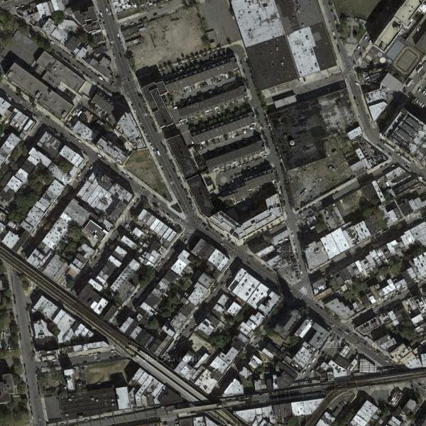</td>
      <td>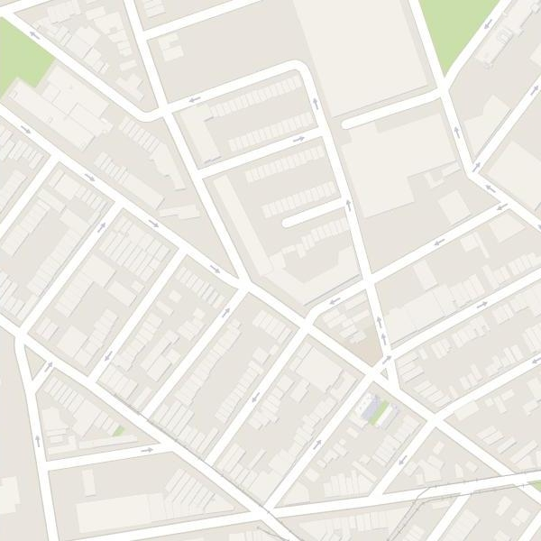</td>
      <td>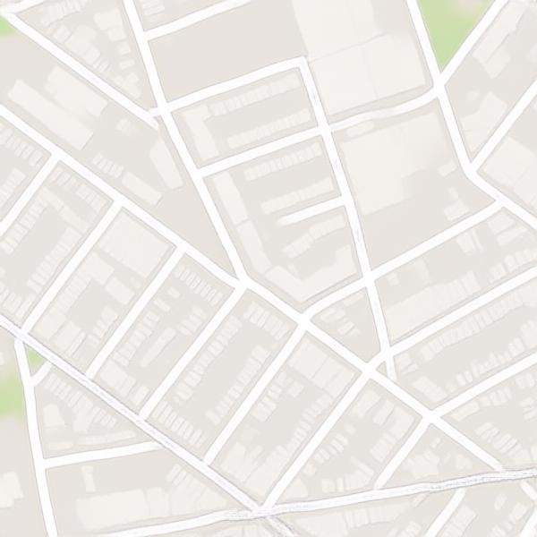</td>              
    </tr>
     <tr>
      <td>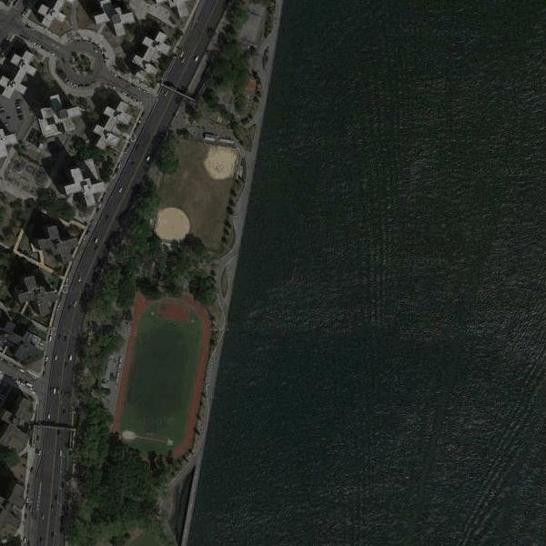</td>
      <td>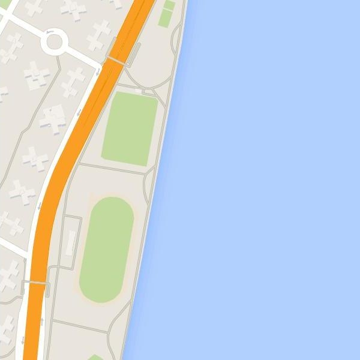</td>
      <td>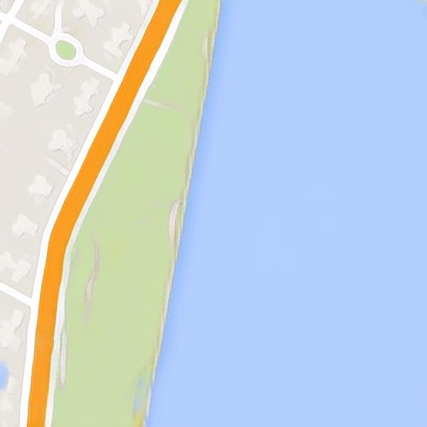</td>              
    </tr>
    <tr>
      <td>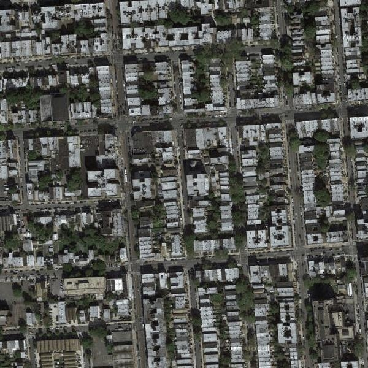</td>
      <td>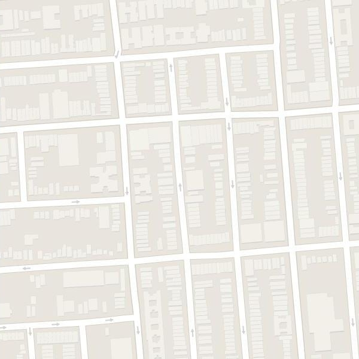</td>
      <td>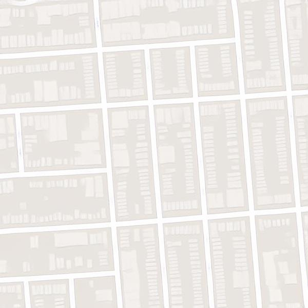</td>              
    </tr>
    <tr>
      <td>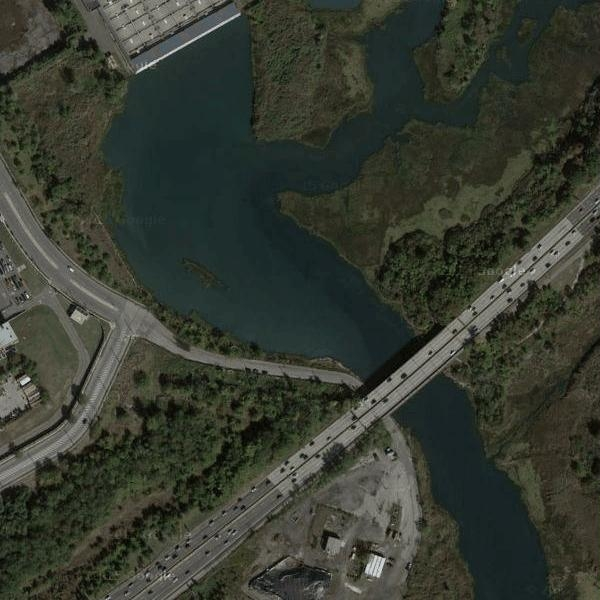</td>
      <td>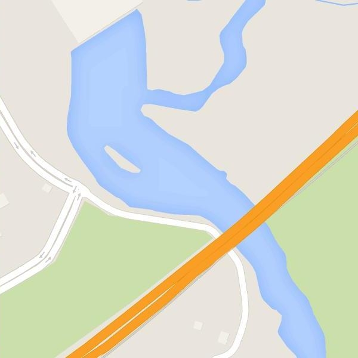</td>
      <td>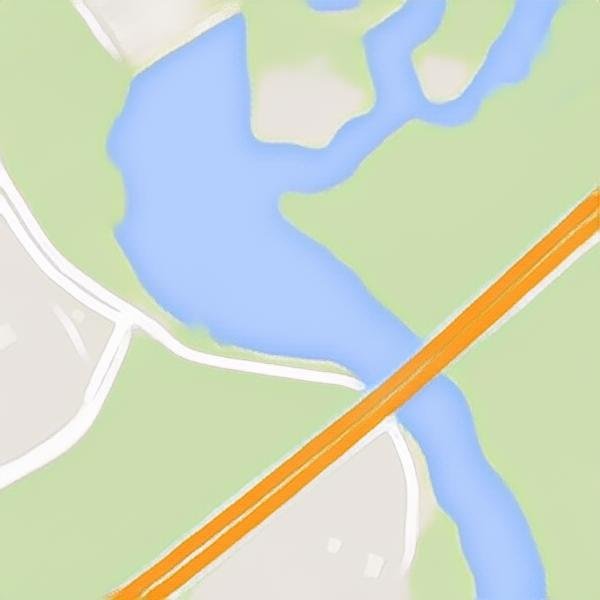</td>              
    </tr>
    <tr>
      <td>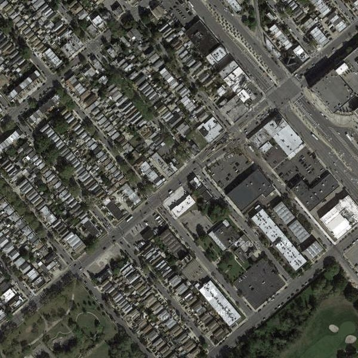</td>
      <td>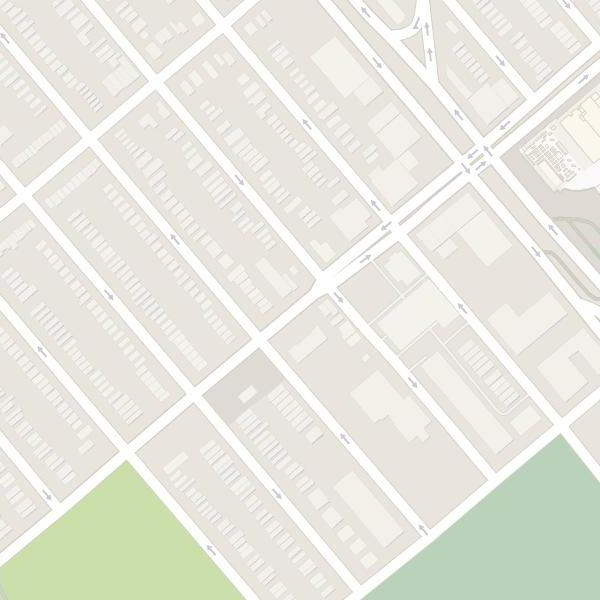</td>
      <td>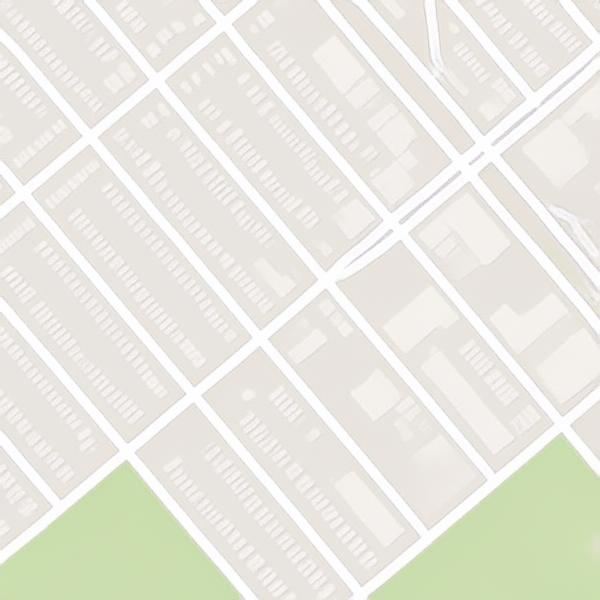</td>              
    </tr>
    <tr>
      <td>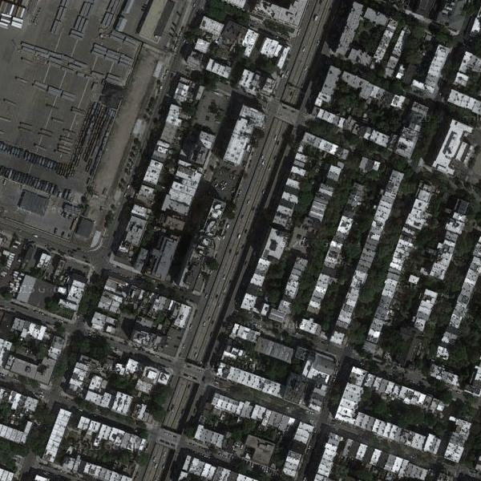</td>
      <td>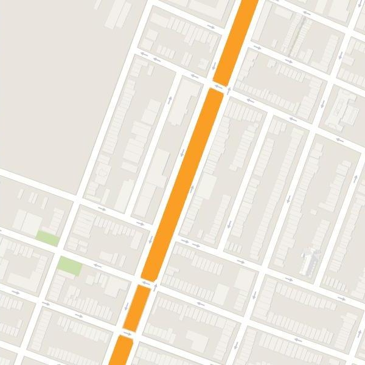</td>
      <td>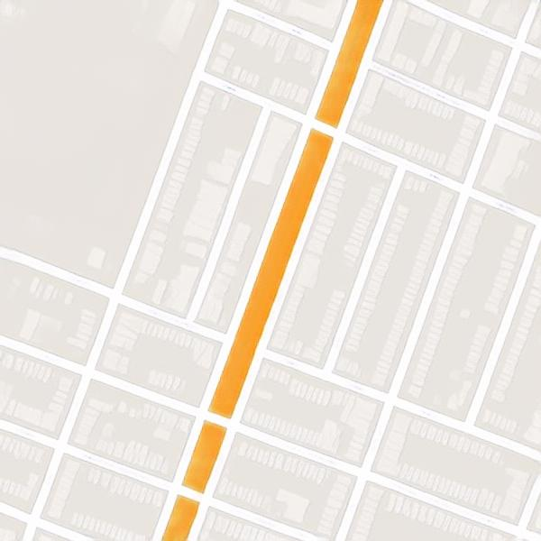</td>              
    </tr>
</table>


# Acknowledgements

Our work borrows code from the following repos:

https://github.com/advimman/lama

https://github.com/fenglinglwb/MAT
